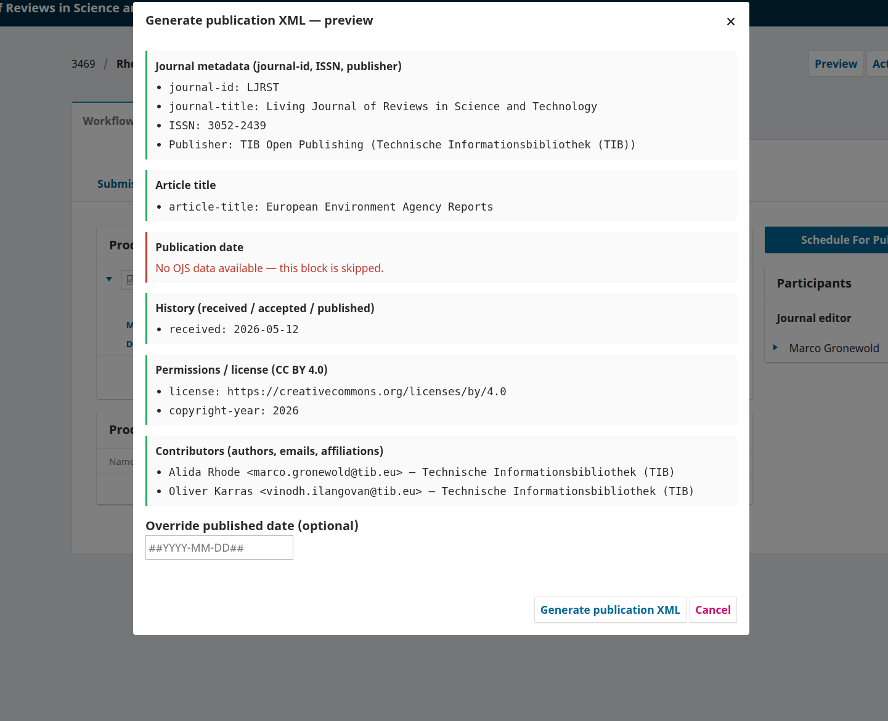

# XML Converter Plugin

Converts JATS-XML and TEI-XML formats in OJS, supporting interoperability between publication systems (OJS, Lodel, Janeway). Developed by [TIB](https://www.tib.eu) with [OpenEdition](https://www.openedition.org/) as part of [Craft-OA](https://www.craft-oa.eu/), using [Métopes](https://www.metopes.fr/metopes.html) stylesheets.

## Compatible OJS Versions

3.3.0 | 3.4.0 | 3.5.0

## Installation

```bash
cd $OJS
git clone -b stable-3_5_0 https://github.com/withanage/xmlConverter.git plugins/generic/xmlConverter
cd plugins/generic/xmlConverter
npm install
npm run build
cd $OJS
php lib/pkp/tools/installPluginVersion.php plugins/generic/xmlConverter/version.xml
```

## Activation

Enable **XML Converter Plugin** in *Settings > Website > Plugins*.

## Usage

### Generate publication XML

Builds a publication-ready JATS XML file from an existing XML file in the
production stage. Open a submission's *Production* file list and choose
"Generate publication XML" from the actions of any XML file.

A preview modal first summarises the metadata that will be written, in the
order it appears in the generated XML:



- Journal metadata: journal-id (acronym), journal title, online ISSN,
  publisher institution
- Article title
- Publication date: with first/last page parsed from the publication's
  page range
- History: received (date submitted), accepted (editorial decision),
  published
- Permissions / license: license URL (publication, falling back to the
  journal default and then CC BY 4.0) and copyright year
- Contributors: authors with email, affiliation, and ORCID when present

Sections without OJS data are flagged as "No OJS data available" and skipped,
so missing values can be fixed before generating. The modal offers
two optional overrides: the publication date (`YYYY-MM-DD`) and the
license URL; left empty, the values from the publication are used.

On "Generate publication XML" the plugin strips placeholder metadata from the
source JATS header, writes the OJS metadata into the document, and stores the
result as a new *Production Ready* XML file. The file is named after the
submission id and the author family names, e.g. `3469_Rhode.xml`,
`3469_Rhode_and_Karras.xml`, or `3469_Rhode_et_al.xml` for more than two
authors.

## Development

Rebuild the frontend bundles after changing anything under `resources/js`.
The build also regenerates `registry/uiLocaleKeysBackend.json` from the locale
keys referenced in the Vue sources, so commit the rebuilt assets along with
your changes.

```bash
npm run build          # both bundles
npm run dev:default    # rebuild the default bundle on change
```

Run the unit tests from the OJS root:

```bash
./lib/pkp/lib/vendor/bin/phpunit --bootstrap lib/pkp/tests/phpunit-bootstrap.php \
    plugins/generic/xmlConverter/tests/
```


## Contributors

Jeanette Hatherill, Edith Cannet, Marisa Tutt, Martin Brändle, Dominique Roux, João Martins, Jean-Christophe Souplet, Ipula Ranasinghe, Dulip Withanage
